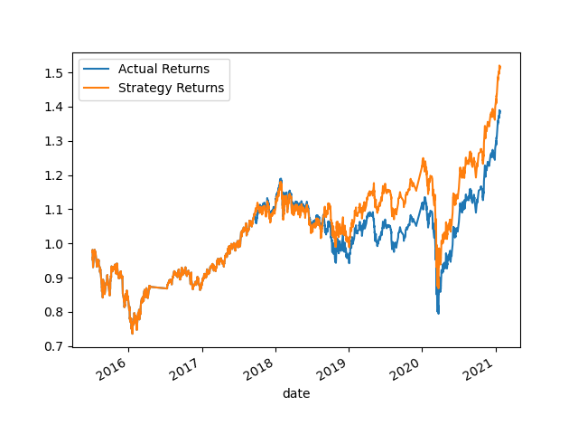

# Algorithmic Trading Bot with Machine Learning

This challenge aims to enhance the algorithmic trading systems of a top financial advisory firm by incorporating machine learning algorithms. The goal is to create a trading bot that can adapt to new data and evolving markets, thus maintaining the firm's competitive advantage in the industry. 

# Overview

As a financial advisor at one of the world's leading financial advisory firms, you understand the significance of speed in trading. Your firm has previously utilized computer algorithms to execute trades faster than human traders, which has been a key factor in its success. However, these systems were limited by the need for specific programming, making it challenging to adapt to new data and changing market conditions.

To improve the existing algorithmic trading systems, you will leverage machine learning algorithms to enhance the trading signals. By combining your financial Python programming skills, machine learning expertise, and algorithmic trading knowledge, you will develop an algorithmic trading bot capable of learning and adapting to new data and evolving markets.

# Objectives

- Implement an algorithmic trading strategy using machine learning to automate trade decisions.
- Adjust the input parameters to optimize the trading algorithm.
- Train a new machine learning model and compare its performance to that of a baseline model.

# Evaluation

## Baseline:

Using SMA trading strategy with short and long windows of 4 and 100 respectively, an offset of 3 months, the performance of this trading algorithm serves as our baseline. A cummulative return plot was generated as follow:

The performance metrics of the baseline model are as follows:

- Precision: 0.50
- Recall: 0.55
- F1-score: 0.43
- Accuracy: 0.55

The baseline model achieved a precision of 0.50, indicating that when it predicted a positive class (1.0), it was correct 50% of the time. The recall value of 0.55 suggests that the model identified 55% of the positive instances correctly. The F1-score, which combines precision and recall, is 0.43. The overall accuracy of the baseline model is 0.55, meaning it correctly classified 55% of the instances.

## Tuning the Baseline:

Using LogisticRegression, with the short and long windows adjusted to 2 and 60 respectively and an offset of 6 months, we re-evaluate the algorithm's performance and a new cummulative return plot is generated as:

The performance metrics of the tuning model are as follows:

- Precision: 0.50
- Recall: 0.56
- F1-score: 0.41
- Accuracy: 0.56

Comparing the tuning model with the baseline model, the precision remains the same at 0.50. However, the recall has improved to 0.56, indicating that the tuning model identified 56% of the positive instances correctly. The F1-score for the tuning model is 0.41, which is slightly lower than the baseline model's F1-score. The accuracy of the tuning model is 0.56, showing a slight improvement over the baseline model.

Comparing the performance of the two models, it can be observed that the tuning model achieved a slightly higher recall and accuracy compared to the baseline model. However, the F1-score of the tuning model is slightly lower than that of the baseline model. This suggests that the tuning model may have improved in identifying positive instances but at the cost of decreased precision.

Both models have relatively low precision scores, indicating that they have a higher tendency for false positives. This implies that a significant number of instances predicted as positive are actually negative. It would be important to analyze the implications of false positives and false negatives in the context of the algorithmic trading system to determine the impact on the overall trading strategy.